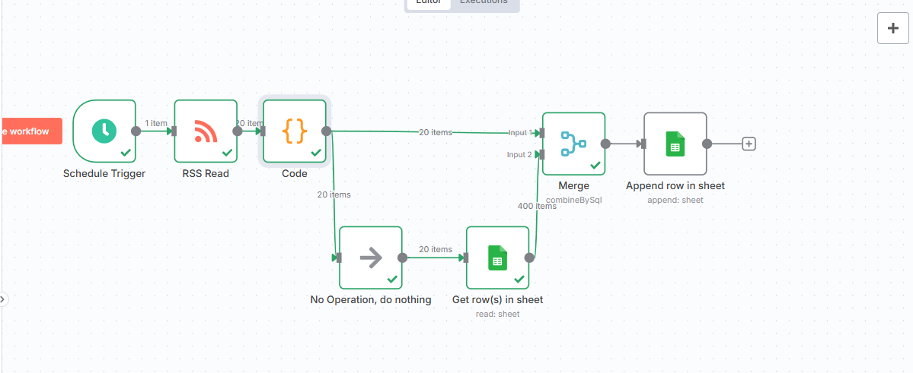
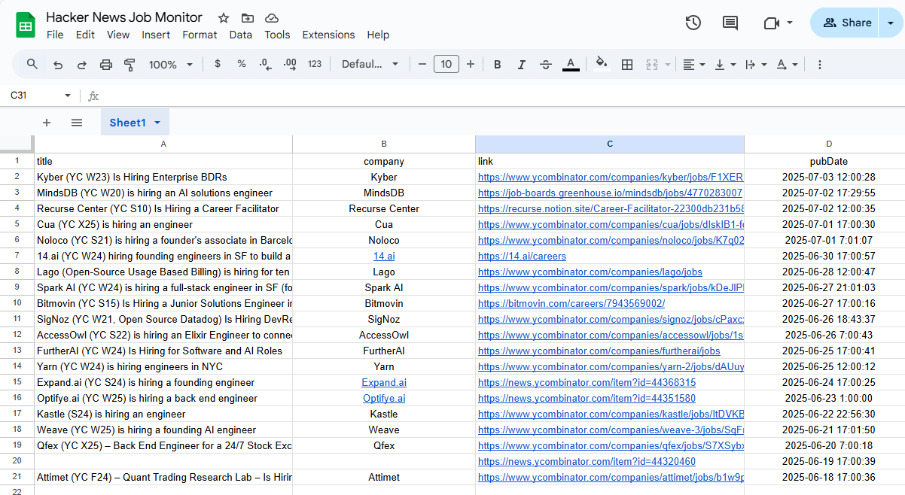

# 📰 Hacker News Job Monitor

A Make.com (or n8n) workflow that fetches new “Jobs” posts from Hacker News via the HNRSS feed, parses out title, company, link, and publication date, de‑duplicates entries, and logs them into Google Sheets.

## 🔧 What It Does

1. **HTTP Request** to https://hnrss.org/jobs  
2. **Parse XML** into JSON  
3. **Extract & transform**  
   - Split out `company` from the title  
   - Clean up `pubDate` into a human format  
   - Tag each record with `source`, `scraped_at`, and `status`  
4. **Deduplicate** (via a SQL merge or lookup)  
5. **Append** new rows to Google Sheets  
6. (Optional) **Schedule** to run every X minutes or hours  

## 🛠 Tools Used

| Tool          | Purpose                         |
|---------------|---------------------------------|
| Make.com/n8n  | Orchestrate HTTP → XML → Sheets |
| Google Sheets | Central job log & dedup store   |

## 🧪 Sample Run

  


## 📁 Files

- `Hacker News Job Monitor.json` — the workflow blueprint  
- `screenshots/` — visuals showing the parsed feed and the sheet entry  

## ✅ Setup

1. Create a Google Sheet with columns:
   ```text
   title | company | link | pubDate | source | scraped_at | status
